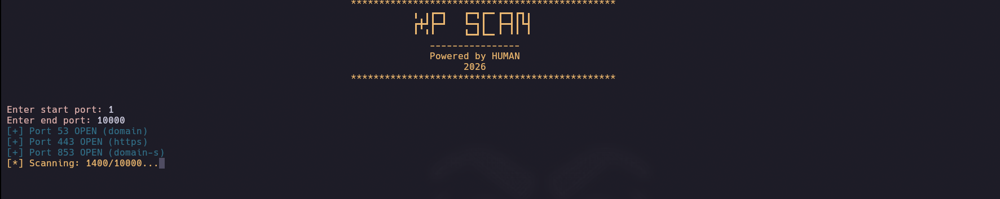
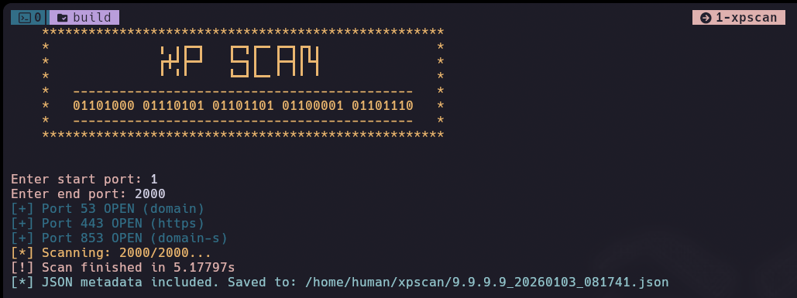

<p align="center">
  
</p>

# XP-SCAN

A high-performance, multithreaded TCP port scanner for Linux.


## Demo

<p align="center">
  
</p>
---------------------

<p align="center">
  
</p>

## Authors

- [@sidatii](https://www.github.com/sidatii)

## Dependencies

1- cMake
2- g++
2- git

## Features

- Open ports and service names
- Custom port range scanning
- Full port range scanning
- Json and text export format

### Non-Blocking Architecture
Unlike traditional scanners that wait (block) for each connection to time out, `xpscan` utilizes:
- **`O_NONBLOCK`**: Sockets are set to non-blocking mode immediately after creation.
- **`select()`**: Multiplexing is used to monitor socket writability with a precise 500ms window.
- **Thread Pooling**: A sliding window of threads ensures maximum CPU utilization without hitting OS file descriptor limits.

### Configuration
The tool follows the **XDG Base Directory Specification**, storing persistent configurations in `~/.config/.xpscan/path.conf`.

## Installation

Install xpscan using curl

```bash
bash <(curl -sSL https://raw.githubusercontent.com/Sidatii/xpscan/refs/heads/master/install.sh)
```


## Run Locally

Clone the project

```bash
  git clone https://github.com/Sidatii/xpscan
```

Go to the project directory

```bash
  cd xpscan
```

Make build directory

```bash
  mkdir build && cd build
```

Compile the project

```bash
  cmake ..
```

```bash
  make
```
Run the binary

```bash
  ./xpscan
```
## Usage/Examples

```bash
xpscan <IP> [OPTIONS]
```

```bash
# No args -> interactive session
xpscan 8.8.8.8 

# Full range scan
xpscan 8.8.8.8 --full

# Export result to json/txt
xpscan 8.8.8.8 --full --json
xpscan 8.8.8.8 --full --txt

```


## Tech Stack

**Dev:** C++

**Build:** cMake, Make

